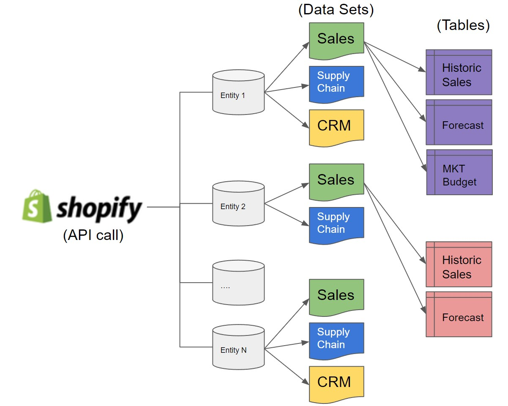

# dbt-dynamic-sourcing
This script shows a way to dynamically source different data sets without the need to bring explicit naming to the data sources.

This project leverages DBT to aggregate and transform data across multiple datasets in a data warehouse. By dynamically handling variations in available datasets and their columns, the tool ensures comprehensive and error-free data analysis across different datasets.

# Overview
Each Dataset has its data stored in separate schemas are prefixed (in this example we use "shopify_") and contain tables which are similar in principle. Given the variability in the presence of specific tables and columns across these schemas, this DBT project intelligently aggregates only the available data to avoid errors, focusing on aggregating information.

# Features
- Dynamic Dataset Handling: Automatically detects and includes only the available datasets and columns for each brand, ensuring compatibility and reducing the risk of errors.
- Comprehensive Data Aggregation: Combines common data (only present across all datasets) with dataset-specific data, providing a complete record of available data.
- Modular Design: Utilizes DBT's modular SQL capabilities for efficient data transformation and analysis.

# Getting Started
## Prerequisites
DBT installed and configured in your environment.
Access to a data warehouse ( in the example we use Shopify data) organized according to the schema naming convention (in the example we use shopify_%).

# Example problem:
Many Datasets are loaded/exchanged/updated to GCP making it necessary to update the "source.yml" file each time.

Imagine the following:

1) Every entity (grey) has their own Datasets (colorful sheets in the middle)
2) Every Dataset (colorful sheets) could have OR NOT the *STANDARD* tables
3) Each Table must contain the same columns (just for the simplicity)

### >>PLEASE OBSERVE that entity 2 does not have CRM Dataset as entity 1 has 

###  AND the Sales Dataset does not have the same 3 tables as entity 1 (color purple and Rose). <<

### Consequences:
1) Time lost.
2) Human input error.
3) Script re-adjustment.

# Solution 

1) Get dataset information through GCP information in run-time.
2) Adapt script with information from point 1 by leveraging dbt-jinja capabilities.
3) Use dynamic sourcing for each dataset found in GCP.

# Cons:
1) No lineage trace on dbt since is dynamically traced and not statically.
